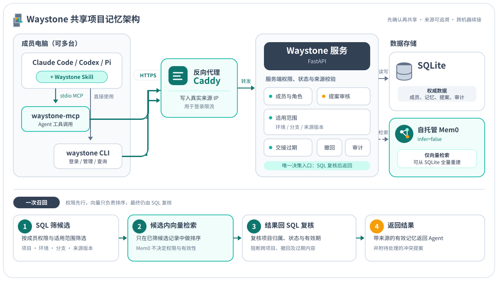

<p align="center">
  
</p>

<p align="center"><strong>给团队 AI 编程助手用的共享项目记忆：先确认再共享，来源可追溯，换机器也能接着干。</strong></p>

<p align="center">
  <a href="LICENSE"></a>
  
  
  <a href="https://github.com/hb407033/waystone/actions/workflows/tests.yml"></a>
</p>

Waystone 是路边的指路石。每个 Agent 把**经过人确认**的结论留成路标，下一台机器、下一个同事、下一个 Agent 沿着它继续走，不必从头摸索。

---

## 为什么需要它

Claude Code、Codex 这类编程助手各有自己的原生记忆，但这些记忆**只在一台机器、一个人身上**：

- 换一台电脑继续昨天的任务，得把背景重新讲一遍；
- 同事的 Agent 不知道团队已经定下的架构决定，照自己的理解重做；
- 直接把对话丢进向量库，又会混进没确认的猜测、过期的交接和误贴的密钥，还分不清谁有权修改。

Waystone 在它们中间加了一层**有权限、有审核、有来源**的团队记忆服务。它不替代 `CLAUDE.md` / `AGENTS.md` 这类规则文件，也不改写各 Agent 的原生记忆；召回的内容只是带来源的参考资料。

## 核心特性

| 能力 | 说明 |
|---|---|
| 按项目隔离 | 每个项目独立成员与权限：所有者（owner）、协作者（collaborator）、只读（reader）；移除成员立即失去访问 |
| 先确认再发布 | 导入文件先在本地离线预览；发布时客户端和服务端都拦截明显的凭据 |
| 修改走提案 | 同一主题、同一环境和分支的新内容成为**待确认提案**，由所有者采纳、重新提交或拒绝，不会“后写的覆盖先写的”，历史全部保留 |
| 适用范围 | 每条记忆可标注环境（prod/dev）、适用分支、来源版本；查询时先按范围筛选再检索 |
| 交接记录 | `handoff` 类记忆记录进度、证据和下一步，默认 7 天后不再召回；到期的提案自动失效 |
| 撤回 | 误发内容可撤回：抹掉正文、删除向量，保留主题、作者、时间和审计；所有者或作者本人可操作 |
| 可恢复的检索 | SQLite 是唯一权威数据源，向量索引（自托管 Mem0）可随时全量重建；向量结果回 SQL 再核对项目和状态，不会串项目 |
| Agent 友好 | stdio MCP 工具 + 命令行 + Agent Skill；浏览器设备码登录，Agent 全程接触不到密码 |
| 运维闭环 | 就绪探针会真实查询向量库；登录按真实来源 IP 限流（兼容 Cloudflare）；审计日志；定时备份、恢复演练与异地拉取脚本 |

## 架构

<p align="center">
  
</p>

一次召回的顺序：先用 SQL 按成员权限和适用范围筛出候选记录 → 只在候选记录里做向量检索 → 结果回 SQL 复核项目归属、状态和有效期 → 返回给 Agent，并附上待处理的冲突提案和“未注明范围”的提示。

## 快速开始

### 1. 部署服务端

前置条件：Linux 服务器、Docker、一个自托管的 [Mem0](https://docs.mem0.ai/open-source/setup)（官方服务，已创建管理员并生成服务用 API Key）、一个能签发 HTTPS 证书的域名。

```bash
git clone https://github.com/hb407033/waystone.git
cd waystone
docker build -t waystone:0.5.0 .
```

把 Mem0 服务 API Key 保存到 `deploy/secrets/mem0_key`（权限 600，不要提交到 Git），按实际情况修改 `deploy/compose.yaml` 里的 Mem0 地址和 Docker 网络名，然后启动：

```bash
docker compose -f deploy/compose.yaml up -d
```

服务只监听宿主机 `127.0.0.1:8900`。参考 [`deploy/Caddyfile.example`](deploy/Caddyfile.example) 配置反向代理和域名，确认就绪：

```bash
curl https://memory.example.com/ready
```

完整的部署、备份、监测与恢复说明见 [docs/operations.md](docs/operations.md)。

### 2. 安装客户端

```bash
uv tool install "git+https://github.com/hb407033/waystone@v0.5.0"
waystone login --server https://memory.example.com
```

`login` 会打印一个浏览器授权链接，在浏览器里核对设备并登录即可。第一次使用由 Mem0 管理员账号登录；其他成员通过邀请链接注册自己的账号，之后同样可以创建项目。

### 3. 接入 Agent

```bash
# Claude Code
claude mcp add --scope user --transport stdio waystone -- waystone-mcp
# Codex
codex mcp add waystone -- waystone-mcp
```

把 [`skills/waystone/SKILL.md`](skills/waystone/SKILL.md) 放到 `~/.claude/skills/waystone/`（Codex、Pi 放到 `~/.agents/skills/waystone/`）。给 Agent 执行的逐步安装说明见 [docs/install.md](docs/install.md)。

### 4. 在项目里使用

```bash
cd your-repo
waystone init "官网改版"                 # 创建项目并绑定当前目录，不上传任何文件
waystone invite colleague@example.com    # 生成邀请链接，由你转交
waystone import README.md --preview-only # 离线预览，确认后去掉 --preview-only 发布
waystone recall "登录模块有哪些已确认的决定？"
```

也可以直接对 Agent 说：“把刚才确认的数据库选型存进项目记忆”“接手 task-123 前先查一下项目记忆”。

## MCP 工具

| 工具 | 作用 |
|---|---|
| `project_list` / `project_init` / `project_bind` | 列出、创建、绑定项目 |
| `memory_preview` | 离线预览要导入的 Markdown/TXT，不上传 |
| `memory_recall` | 按问题、环境、分支召回有效记忆 |
| `memory_publish` | 用户确认内容后发布一条记忆 |
| `memory_entries` | 分页查看全部记录、提案与历史 |
| `memory_resolve` / `memory_rebase` / `memory_reject` | 所有者处理冲突提案 |
| `memory_retract` | 撤回误发内容 |
| `memory_reindex` | 分批修复或全量重建向量索引 |

登录、加入项目等涉及凭据的操作只能通过命令行和浏览器完成，不开放给模型调用。

## 配置

| 环境变量 | 位置 | 说明 |
|---|---|---|
| `WAYSTONE_DB` | 服务端 | SQLite 路径，默认 `/data/waystone.sqlite` |
| `MEM0_URL` | 服务端 | Mem0 服务地址 |
| `MEM0_KEY_FILE` | 服务端 | Mem0 API Key 文件路径 |
| `FORWARDED_ALLOW_IPS` | 服务端 | uvicorn 信任的转发来源，配合反向代理按真实 IP 限流 |
| `WAYSTONE_SERVER` | 客户端 | 服务地址；也可以在 `waystone login --server` 时指定并保存到本机会话 |
| `WAYSTONE_PROFILE` | 客户端 | 本机会话文件路径，默认 `~/.config/waystone/session.json`（权限 600） |
| `WAYSTONE_TRUST_ENV` | 客户端 | 设为 `1` 时读取 `HTTPS_PROXY`、`SSL_CERT_FILE` 等代理与证书环境变量 |

## 安全模型与已知边界

我们尽量把“能做到什么、做不到什么”写清楚：

- **信任边界**：所有权限判断都在服务端完成；仓库里的绑定文件 `.waystone.json` 只记录项目 ID 和服务地址，不能授予权限，也不能把会话令牌引到别的服务器。
- **记忆不是指令**：召回结果明确标注为参考资料，不能覆盖用户要求、规则文件或工具权限。但共享记忆仍可能成为跨机器传播错误信息的通道，发布前请人工审阅。
- **凭据检测是辅助**：只拦截明显的密钥写法，不能保证发现所有秘密。
- **撤回的残留**：撤回会抹掉数据库正文并删除向量，但已生成的备份要到保留期后才轮换掉，Mem0 自身的历史库也可能留有原文，需要运维清理。
- **目前不支持**：高可用多实例、项目所有者转让、会话列表与远程吊销、改密码、跨主题的语义矛盾识别。
- **限流**：按单个来源 IP 计数；IPv6 客户端可以在同一网段内更换地址。

与 Agent 原生记忆如何分工，见 [docs/memory-coexistence.md](docs/memory-coexistence.md)。安全问题请按 [SECURITY.md](SECURITY.md) 私下报告。

## 开发

```bash
uv sync --extra test
uv run pytest -q
```

测试覆盖权限与跨项目隔离、提案状态流转、撤回与向量清理、限流来源 IP（本机有 Docker 和 `caddy:2` 镜像时会在容器里实跑 Caddy）、真实 stdio MCP 到 HTTP 的往返。`deploy/smoke.py` 用于在服务器上连真实 Mem0 做隔离验收，并清理本次测试产生的向量。

## 路线图

- 项目所有者转让与增补
- 会话列表、远程吊销与改密码
- 可选的内置向量索引，去掉对独立 Mem0 服务的依赖
- 同主题语义矛盾提示
- 发布到 PyPI（包名 `waystone-memory`）
- 英文文档

## 参与贡献

欢迎提交 Issue 和 Pull Request，流程见 [CONTRIBUTING.md](CONTRIBUTING.md)。版本变化见 [CHANGELOG.md](CHANGELOG.md)。

## 许可证

[Apache License 2.0](LICENSE)
