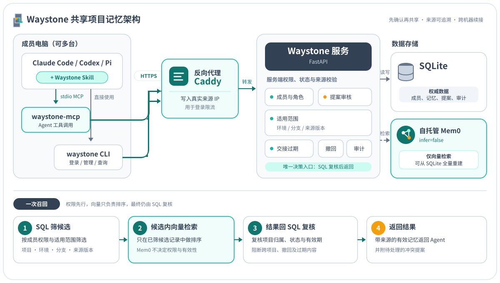

<p align="center">
  
</p>

<p align="center"><strong>Shared team memory for AI coding assistants: confirmed before sharing, provenance-tracked, pick up where you left off on any machine.</strong></p>

<p align="center">
  <a href="LICENSE"></a>
  
  
  <a href="https://github.com/hb407033/waystone/actions/workflows/tests.yml"></a>
</p>

A waystone is a roadside marker. Each agent leaves human-confirmed conclusions as waymarks, so the next machine, the next teammate, the next agent can follow them instead of rediscovering everything from scratch.

---

## Why Waystone

Coding assistants like Claude Code and Codex each have their own native memory, but that memory **lives on one machine, with one person**:

- Switch to another computer to pick up yesterday's task and you have to re-explain all the context;
- A colleague's agent doesn't know the architecture decisions the team already made and redoes the work its own way;
- Dump raw conversation into a vector store and unverified guesses, stale handoffs, and accidentally pasted secrets get mixed in — with no clear sense of who is allowed to change what.

Waystone adds a layer of **permissioned, reviewed, provenance-tracked** team memory between them. It doesn't replace rules files like `CLAUDE.md` / `AGENTS.md`, and it doesn't rewrite any agent's native memory; recalled content is just provenance-attributed reference material.

## Key features

| Capability | Description |
|---|---|
| Per-project isolation | Independent members and permissions per project: owner, collaborator, reader; a removed member loses access immediately |
| Confirmed before publishing | Imported files are previewed locally offline first; both client and server block obvious credentials at publish time |
| Changes go through proposals | New content on the same topic, environment, and branch becomes a **pending proposal** that an owner accepts, rebases, or rejects — newer writes never silently overwrite older ones, and the full history is kept |
| Scope | Each memory can be tagged with an environment (prod/dev), applicable branch, and source version; queries filter by scope before searching |
| Handoffs | `handoff` memories record progress, evidence, and next steps; they stop being recalled after 7 days by default; expired proposals lapse automatically |
| Retraction | Accidentally published content can be retracted: the body is wiped, the vector is deleted, and topic, author, timestamp, and audit trail are kept; the owner or the original author can do this |
| Recoverable search | SQLite is the single source of truth; the vector index (self-hosted Mem0) can be fully rebuilt at any time; vector results are cross-checked back against SQL for project and status — no cross-project leakage |
| Agent friendly | stdio MCP tools + CLI + an Agent Skill; browser device-code login, so agents never touch a password |
| Operational closure | The readiness probe queries the vector store for real; login is rate-limited by real source IP (Cloudflare-compatible); audit log; scheduled backups, restore drills, and off-site pull scripts |

## Architecture

<p align="center">
  
</p>

A recall flows in this order: SQL first narrows the candidate records by member permissions and scope → vector search runs only within those candidates → results are checked back against SQL for project ownership, status, and validity period → the results are returned to the agent, along with any pending conflicting proposals and a note about memories with unspecified scope.

## Quick start

### 1. Deploy the server

Prerequisites: a Linux server, Docker, a self-hosted [Mem0](https://docs.mem0.ai/open-source/setup) (official service, with an admin created and a service API key generated), and a domain that can get an HTTPS certificate.

```bash
git clone https://github.com/hb407033/waystone.git
cd waystone
docker build -t waystone:0.5.0 .
```

Save the Mem0 service API key to `deploy/secrets/mem0_key` (mode 600, do not commit to Git), edit the Mem0 address and Docker network name in `deploy/compose.yaml` to match your setup, then start:

```bash
docker compose -f deploy/compose.yaml up -d
```

The service only listens on the host's `127.0.0.1:8900`. See [`deploy/Caddyfile.example`](deploy/Caddyfile.example) to configure the reverse proxy and domain, then verify it's ready:

```bash
curl https://memory.example.com/ready
```

Full deployment, backup, monitoring, and recovery instructions are in [docs/operations.md](docs/operations.md).

### 2. Install the client

```bash
uv tool install "git+https://github.com/hb407033/waystone@v0.5.0"
waystone login --server https://memory.example.com
```

`login` prints a browser authorization link; review the device in the browser and sign in. The first login should use the Mem0 admin account; other members register their own accounts via invite links, after which they can also create projects.

### 3. Connect your agents

```bash
# Claude Code
claude mcp add --scope user --transport stdio waystone -- waystone-mcp
# Codex
codex mcp add waystone -- waystone-mcp
```

Copy [`skills/waystone/SKILL.md`](skills/waystone/SKILL.md) to `~/.claude/skills/waystone/` (for Codex and Pi, `~/.agents/skills/waystone/`). Step-by-step installation instructions for agents are in [docs/install.md](docs/install.md).

### 4. Use it in a project

```bash
cd your-repo
waystone init "Website Redesign"        # Create a project and bind the current directory; nothing is uploaded
waystone invite colleague@example.com  # Generate an invite link and pass it along
waystone import README.md --preview-only # Offline preview; drop --preview-only to publish after review
waystone recall "What decisions about the login module have been confirmed?"
```

Or just tell your agent: "Save the database choice we just confirmed into project memory" or "Check the project memory before picking up task-123."

## MCP tools

| Tool | Purpose |
|---|---|
| `project_list` / `project_init` / `project_bind` | List, create, and bind projects |
| `memory_preview` | Preview the Markdown/TXT to import offline, without uploading |
| `memory_recall` | Recall valid memories by question, environment, and branch |
| `memory_publish` | Publish a memory after the user confirms the content |
| `memory_entries` | Page through all records, proposals, and history |
| `memory_resolve` / `memory_rebase` / `memory_reject` | Owner handles conflicting proposals |
| `memory_retract` | Retract accidentally published content |
| `memory_reindex` | Repair or fully rebuild the vector index in batches |

Operations involving credentials — login, joining a project, and the like — can only be done from the command line and the browser, never through model calls.

**Remote connector**: after setting `PUBLIC_URL` on the server, the same set of tools (minus `project_init`, `project_bind`, and `memory_preview`, with `project_id` required instead) is also served over Streamable HTTP at `<server address>/mcp`, authenticated via OAuth (dynamic client registration + PKCE, refresh token rotation). Claude web, Desktop, Cowork, mobile, Claude Code, and Codex can all connect directly, no local client installation needed. See [docs/operations.md](docs/operations.md#remote-connector-oauth).

## Configuration

| Variable | Where | Description |
|---|---|---|
| `WAYSTONE_DB` | Server | SQLite path, default `/data/waystone.sqlite` |
| `MEM0_URL` | Server | Mem0 service address |
| `MEM0_KEY_FILE` | Server | Mem0 API key file path |
| `FORWARDED_ALLOW_IPS` | Server | Forwarding sources trusted by uvicorn; used with the reverse proxy to rate-limit by real source IP |
| `PUBLIC_URL` | Server | Public address (origin); enables the remote connector and OAuth authorization service once set |
| `OAUTH_EXTRA_REDIRECT_URIS` | Server | Additional allowed OAuth redirect URIs, comma-separated, matched verbatim |
| `OAUTH_MAX_PENDING_CLIENTS` | Server | Cap on registered clients that haven't produced a token yet, default 500 |
| `WAYSTONE_SERVER` | Client | Server address; can also be set and saved to the local session via `waystone login --server` |
| `WAYSTONE_PROFILE` | Client | Local session file path, default `~/.config/waystone/session.json` (mode 600) |
| `WAYSTONE_TRUST_ENV` | Client | Set to `1` to read proxy and certificate environment variables like `HTTPS_PROXY` and `SSL_CERT_FILE` |

## Security model and known limitations

We try to be explicit about what this can and cannot do:

- **Trust boundary**: all permission checks happen server-side; the binding file `.waystone.json` in a repository only records the project ID and server address — it grants no permissions and cannot redirect a session token to another server.
- **Memories are not instructions**: recalled results are clearly labeled as reference material and cannot override user requests, rules files, or tool permissions. But shared memory can still spread misinformation across machines, so review content before publishing.
- **Credential detection is best-effort**: it only catches obvious key formats; it cannot guarantee every secret is found.
- **Retraction residue**: retraction wipes the database body and deletes the vector, but generated backups aren't rotated out until the retention period passes, and Mem0's own history store may still hold the original text — this needs operational cleanup.
- **Remote connector**: the application name on the consent page is self-reported by the client and cannot be verified; only approve connections you just initiated. Remote authorizations can be listed and revoked with `waystone connections` / `disconnect`.
- **Sessions**: sessions auto-renew with use within 30 days, with no absolute cap; `logout` only revokes the current session.
- **Not currently supported**: highly-available multi-instance deployment, project ownership transfer, CLI session listing and remote revocation, password changes, cross-topic semantic contradiction detection.
- **Rate limiting**: counted per source IP; IPv6 clients can rotate addresses within the same subnet.

For how this divides labor with agent native memory, see [docs/memory-coexistence.md](docs/memory-coexistence.md). Please report security issues privately following [SECURITY.md](SECURITY.md).

## Development

```bash
uv sync --extra test
uv run pytest -q
```

Tests cover permissions and cross-project isolation, proposal state transitions, retraction and vector cleanup, rate-limit source IP (when Docker and the `caddy:2` image are available locally, Caddy actually runs in a container), and a real stdio-MCP-to-HTTP round trip. `deploy/smoke.py` performs isolated acceptance testing on the server against a real Mem0 and cleans up the vectors produced by the test run.

## Roadmap

- Project ownership transfer and additions
- Session list, remote revocation, and password changes
- Optional built-in vector index, removing the dependency on a standalone Mem0 service
- Same-topic semantic contradiction hints
- Publish to PyPI (package name `waystone-memory`)
- English documentation

## Contributing

Issues and pull requests are welcome; see [CONTRIBUTING.md](CONTRIBUTING.md) for the process. Version changes are in [CHANGELOG.md](CHANGELOG.md).

## License

[Apache License 2.0](LICENSE)
